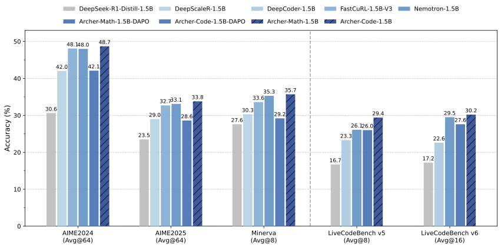
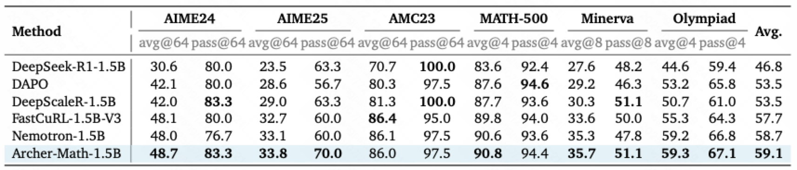
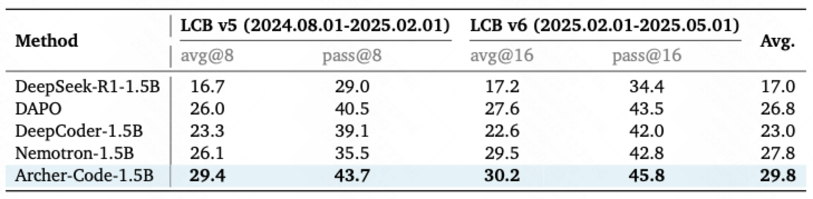

<div align="center">

# ✨ Archer

<div>
🏹️  Reinforcement Learning for Enhanced Code&Math Reasoning in LLMs  🎯
</div>

</div>
<div>
<br>

<div align="center">

[](https://github.com/wizard-III/ArcherCodeR)
[](https://huggingface.co/Fate-Zero/Archer-Code-1.5B)
[](https://huggingface.co/datasets/Fate-Zero/Archer-Code-1.5B)
[](https://wandb.ai/wangjkpkucs-peking-university/ArcherCodeR?nw=nwuserwangjkpkucs)
[](https://zhuanlan.zhihu.com/p/1918765619614057424)

</div>

## Overview

The Archer series focuses on research into RL algorithms and training for medium and small-scale models, aiming to deepen the community's understanding of the fundamental principles of reinforcement learning (RL) on large language models (LLMs). All released content will be comprehensively open-sourced to advance community research development.

<div align="center">


<sub>Archer significantly improves the reasoning performance upon DAPO and outperforms previous 1.5B-level SOTA reasoning models.</sub>
</div>

**Archer** is an open-source initiative enhancing code&math reasoning in large language models through scalable, rule-governed reinforcement learning. We provide full-stack reproducibility including:

- Training code and pipelines
- Curated datasets
- Trained models
- Complete training logs

**Current Models**:
- **[Archer-Code-1.5B](https://huggingface.co/Fate-Zero/Archer-Code-1.5B)** - SOTA among similarly-sized models.

## Evaluation
We conduct evaluation on both mathematical and coding benchmarks. Due to the high variance of the outputs from reasoning models, we report avg@K (pass@1 performance averaged over K outputs) and pass@K for each benchmark. The detailed results are shown in the table below.

<div align="center">





</div>

<!-- Note:
1. Evaluation variance for the same model is typically within ±0.5 across multiple runs.
2. DeepCoder consistently scored around 23 in our tests - lower than its reported performance.
3. NVIDIA's Nemotron-Research-Reasoning-Qwen-1.5B slightly outperformed its reported score, potentially due to different parameter settings in their original evaluation. -->

## Getting Started

### Installation

```bash
# Installing Python 3.10 Environment.
conda create -n archer python=3.10 -y
conda activate archer

# Installing dependencies.
pip install torch==2.5.1 --index-url https://download.pytorch.org/whl/cu124
wget -nv https://github.com/Dao-AILab/flash-attention/releases/download/v2.7.3/flash_attn-2.7.3+cu12torch2.5cxx11abiFALSE-cp310-cp310-linux_x86_64.whl
pip install --no-cache-dir flash_attn-2.7.3+cu12torch2.5cxx11abiFALSE-cp310-cp310-linux_x86_64.whl

cd ArcherCodeR
pip install -e .
```

### Data Preparation

Download the training and test data from Hugging Face.

```bash
python tools/download_datasets.py
```

#### Initialize Ray Cluster

We have provided a one-click script to initialize Ray environments on any number of machines. Run the following command on the head node:

```bash
bash ./tools/start_ray.sh
```

Note: Hostfile locations vary across operating systems (e.g., on my machine, it's located at /etc/mpi/hostfile). Locate the file on your server and modify its content accordingly.

### Training

We have currently only provided the script and data to reproduce the results of the “ArcherCodeR-1.5B-DAPO”.

```bash
bash ./scripts/train/run_archer_qwen2.5_1.5b_code.sh
```

### Evaluation

#### Step 1: Convert model format

Run the following command to convert the model to Hugging Face format:

```bash
bash ./tools/model_merge.sh
```

#### Step 2: Run evaluation

Execute the script below to evaluate model performance on the LiveCodeBench v5 benchmark:

```bash
bash ./scripts/eval/run_eval.sh
```

Note: Please update the path parameters in the scripts above as needed.

## Technical Report

[Stabilizing Knowledge, Promoting Reasoning: Dual-Token Constraints for RLVR](https://arxiv.org/abs/2507.15778)

## Acknowledgements

- We build our model upon [`DeepSeek-R1-Distill-Qwen-1.5B`](https://huggingface.co/deepseek-ai/DeepSeek-R1-Distill-Qwen-1.5B).
- Training was carried out with a modified version of [verl](https://github.com/volcengine/verl).

## Citation

Please cite the following:

```bibtex
@misc{wang2025stabilizingknowledgepromotingreasoning,
      title={Stabilizing Knowledge, Promoting Reasoning: Dual-Token Constraints for RLVR}, 
      author={Jiakang Wang and Runze Liu and Fuzheng Zhang and Xiu Li and Guorui Zhou},
      year={2025},
      eprint={2507.15778},
      archivePrefix={arXiv},
      primaryClass={cs.CL},
      url={https://arxiv.org/abs/2507.15778}, 
}
```

